# 📅 Evently App

A modern, full-featured Event Management application built with **Flutter**. **Evently** provides a seamless user experience for discovering and organizing events, featuring a polished UI with full **Dark & Light Mode** support and robust **Firebase** integration.

---

## 📸 Screenshots Showcase

### 🌓 Theme Experience
The app features a dynamic theme switching system, providing a premium look in both Light and Dark modes.

| Light Mode | Dark Mode |
| :---: | :---: |
| 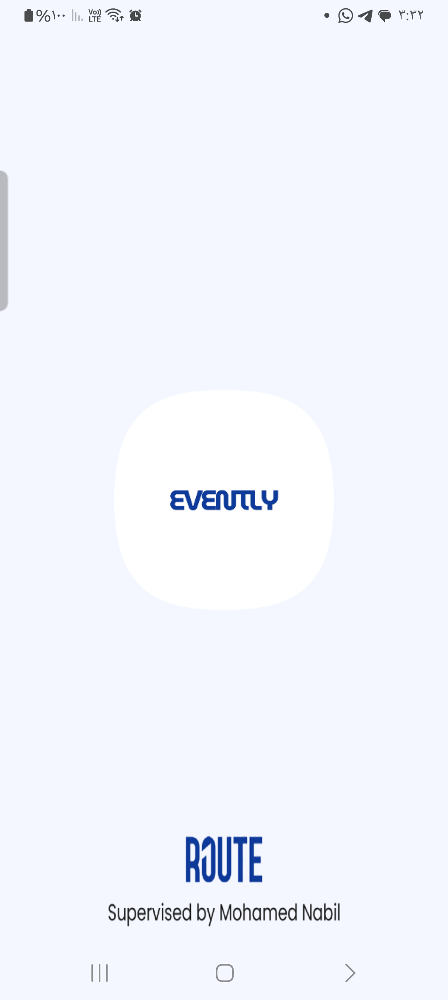 |  |

---

### 🌟 Application Journey

#### 1️⃣ Immersive Onboarding
A guided experience to help users personalize their app settings (Language/Theme) from the first start.

| Welcome | Theme Selection | Feature Discovery |
| :---: | :---: | :---: |
|  | 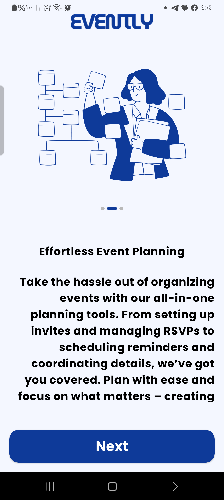 | 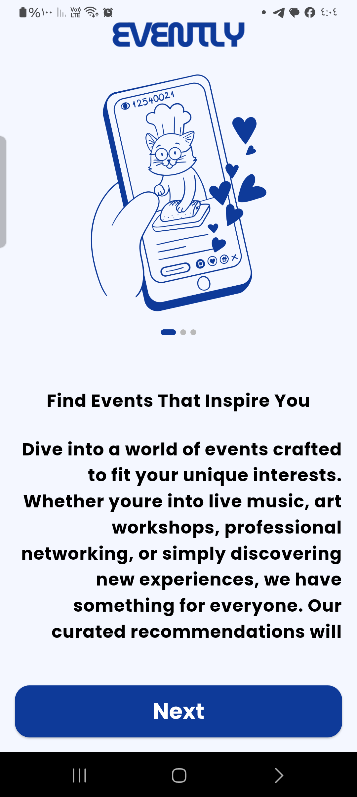 |

#### 2️⃣ Authentication Flow
Secure access with real-time validation and loading states.

| Login Screen | Signup Screen | Google Auth |
| :---: | :---: | :---: |
| 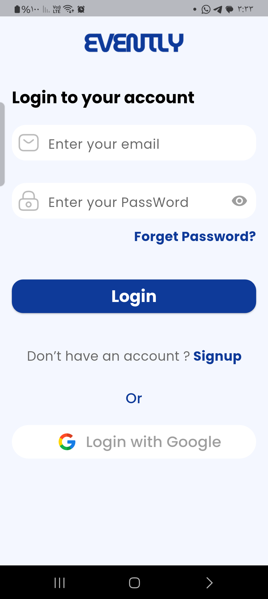 | 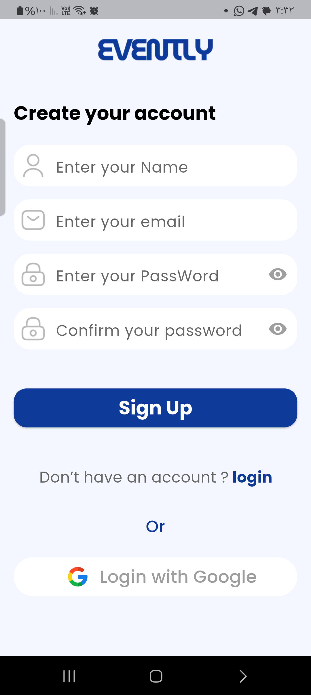 |  |

#### 3️⃣ Event Management
| Home Dashboard | Event Details | Create Event |
| :---: | :---: | :---: |
| 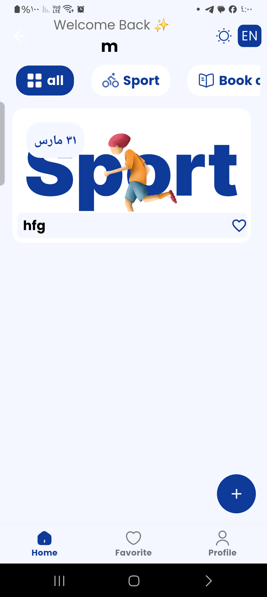 | 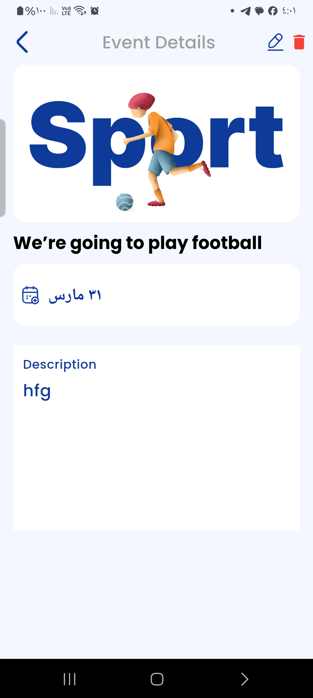 | 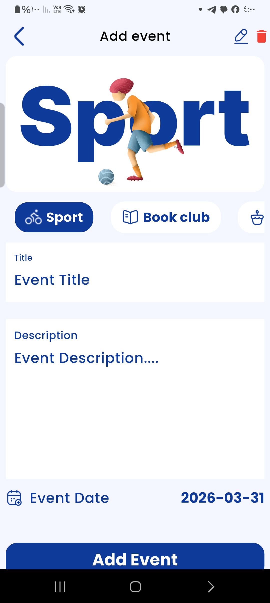 |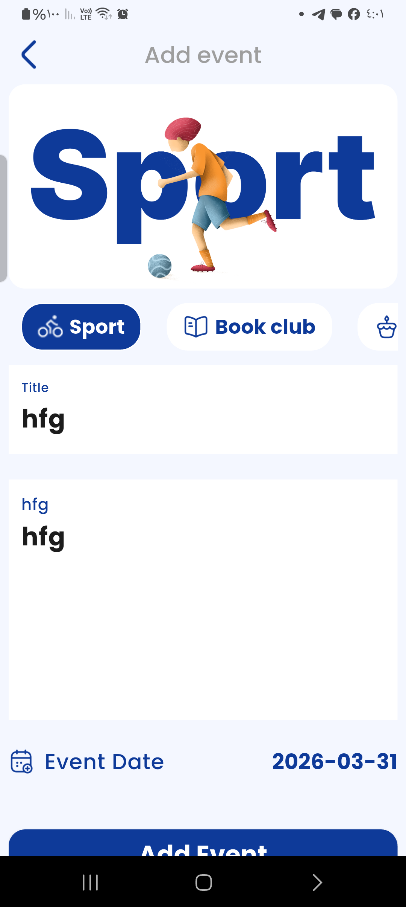 |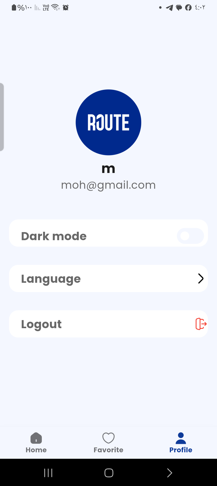 |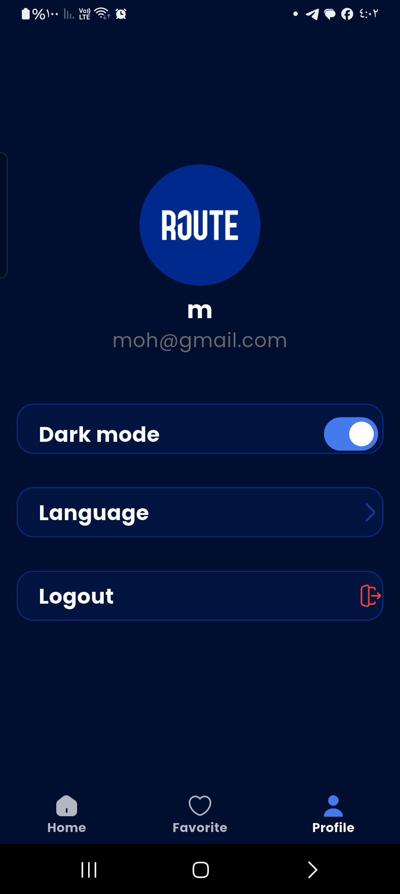 |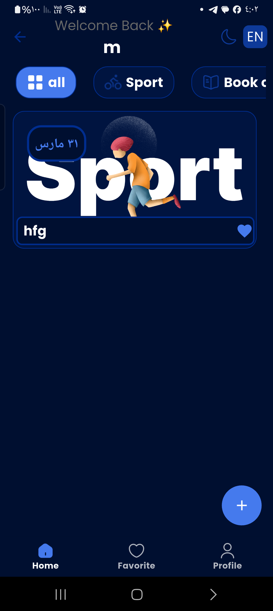 |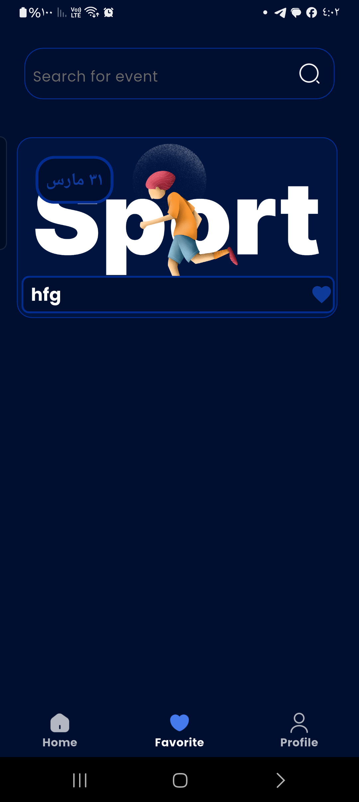 |

---

## ✨ Key Features

* **🌓 Dual Theme System:** Seamlessly switch between Light and Dark modes.
* **🌍 Multi-language Support:** Ready for global users with **Easy Localization** (Arabic/English).
* **🔐 Authentication:** * Email & Password via **Firebase Auth**.
  * **Google Sign-In** for quick and secure access.
* **📅 Cloud Firestore:** Real-time data synchronization for all events.
* **🚀 Smooth UX:** * Interactive **Loading States** on all buttons.
  * Modern splash screen with `flutter_native_splash`.
  * Visual feedback via **SnackBars** for error handling.
* **📱 Responsive Design:** Built using `google_fonts` and `flutter_svg` for pixel-perfect UI.

---

## 🛠 Tech Stack

* **Framework:** Flutter (SDK `^3.10.1`)
* **State Management:** `Provider`
* **Backend:** **Firebase** (Auth, Firestore)
* **Navigation:** `Auto Route` (v11.1.0)
* **Packages:** `introduction_screen`, `flutter_slidable`, `easy_localization`.

---

## 🚀 Installation & Setup

1. **Clone the repository:**
   ```bash
   git clone [https://github.com/Mohamed-Hessein/c17_evently_app.git](https://github.com/Mohamed-Hessein/c17_evently_app.git)
